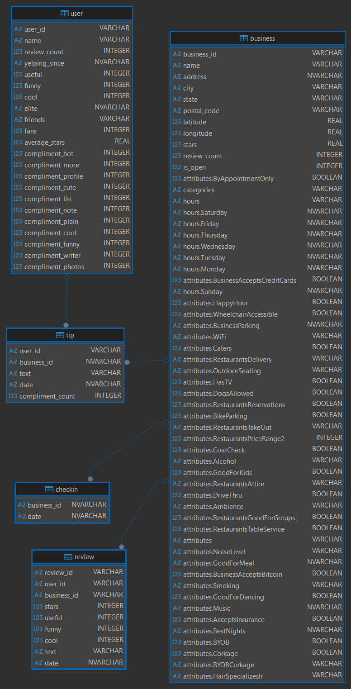

# CoffeeKing Analytics: Optimización de Inversión en Cafeterías (Yelp Dataset)
[English Version](README_EN.md)

## 📌 1. Estructura del Proyecto y Metodología
Este proyecto sigue un enfoque de ingeniería modular para asegurar la trazabilidad entre el negocio y el código:

* **[FASE 01] Propuesta de Proyecto:** Definición del problema, selección del dataset y planteamiento de hipótesis.

    [Ver: 01_Propuesta_Proyecto_CoffeeKing_ES.pdf](/docs/ES/01_Propuesta_Proyecto_CoffeeKing_ES.pdf).
* **[FASE 02] Análisis de Hipótesis:** Validación técnica mediante SQL avanzado y estadística descriptiva.

    [Ver: 02a_H1_Rating_Stability.sql](/scripts/02a_H1_Rating_Stability.sql)

    [Ver: 02b_H2_Temporal_Behavior.sql](/scripts/02b_H2_Temporal_Behavior.sql)

    [Ver: 02c_H3_Analysis.sql](/scripts/02c_H3_Analysis.sql.sql).
* **[FASE 03] Análisis Avanzado y Métricas:** Identificación de correlaciones, implementación de KPIs (PEI/CP) y preparación para procesamiento de texto.

    [Ver: 03_Deep_Analysis_Insights_ES.md](/docs/ES/03_Deep_Analysis_Insights_ES.md)

    [Ver: 03_New_Metrics_Implementation.sql](/scripts/03_New_Metrics_Implementation.sql).
* **[FASE 04] Informe Ejecutivo Final:** Consolidación de hallazgos estratégicos, validación final de KPIs (PEI/CP) y presentación de recomendaciones para la Dirección General. Cierre del ciclo de ingeniería relacional.

    [Ver: 04_Executive_Report_CoffeeKing_ES.md](/docs/ES/04_Executive_Report_CoffeeKing_ES.md).

## 🛠️ 2. Stack Tecnológico Utilizado
* **Base de Datos:** SQLite (`CoffeeKing_Yelp.db`).
* **Gestión SQL:** DBeaver & DB Browser for SQLite.
* **Procesamiento de Archivos:** Git-Bash (Sampling de JSON a CSV).
* **Entorno de Documentación:** Visual Studio Code.

## 📁 3. File Structure
* `/scripts/`: SQL Scripts (`02a_H1_Rating_Stability.sql`, `02b_H2_Temporal_Behavior.sql`, etc.)
* `/docs/`: Informes detallados y propuesta del proyecto.
* `/data/`: (No subido a GitHub) Base de datos local `CoffeeKing_Yelp.db`.
* `/images/`: Diagramas del modelo de datos y documentación visual. <details style="display:inline"><summary><b>Ver Diagrama de Entidad-Relación (ERD)</b></summary><br></details>


## 📊 4. Hallazgos Críticos y Validación de Hipótesis
Tras completar el análisis descriptivo y la correlación de atributos mediante SQL avanzado, se han contrastado las hipótesis iniciales con los siguientes resultados:

### Hipótesis 1 (H1): Umbral de Madurez y Estabilidad
* **Planteamiento:** Se propuso que los negocios con más de 100 reseñas alcanzan una madurez reputacional convergiendo en **4.0 estrellas**.
* **Resultado:** ❌ **REFUTADA**.
* **Evidencia:** Los locales consolidados muestran una media real de **3.81 estrellas**. El volumen de datos aporta estabilidad, pero el mercado es más exigente de lo previsto.
* **Impacto:** Se redefine el **Benchmark de Élite a 3.8 estrellas** para ajustar los KPIs de éxito.

### Hipótesis 2 (H2): Comportamiento Temporal (Perfil Profesional)
* **Planteamiento:** Determinar si existe un perfil de cliente mayoritariamente profesional analizando el volumen de interacción en días laborables.
* **Resultado:** ✅ **CONFIRMADA**.
* **Evidencia:** El procesamiento de fechas revela una dominancia clara del flujo laboral:
    * **Días Laborables (L-V):** **70.5%** de la actividad (705 reseñas).
    * **Fines de Semana (S-D):** **29.5%** de la actividad (295 reseñas).
* **Impacto:** El volumen de negocio es un **138% mayor** durante la semana, validando el enfoque en clientes que teletrabajan.

### Hipótesis 3 (H3): Impacto de Servicios (Wi-Fi vs. Terraza)
* **Planteamiento:** Identificar el factor determinante del rating: infraestructura digital (Wi-Fi) o activos físicos (Terraza).
* **Resultado:** ✅ **CONFIRMADA (Prioridad Tecnológica)**.
* **Evidencia:** * **Wi-Fi Gratis:** Rating medio de **3.81 estrellas** y un impacto neto de **+0.16 estrellas** sobre la media global.
    * **Terraza:** Mejora marginal de la reputación (3.69 vs 3.67).
* **Impacto:** Se recomienda priorizar inversión en **conectividad de alta velocidad** sobre mobiliario exterior.


## 🔍 5. Nuevas Métricas de Ingeniería (KPIs)

Para trascender el análisis descriptivo básico, he diseñado e implementado dos indicadores clave (KPIs) que permiten cuantificar el éxito del modelo de negocio "Work-Friendly" y el retorno de la inversión tecnológica.

### 1. Professional Engagement Index (PEI)
Este índice mide el grado de especialización de un local en el segmento profesional. Se calcula como el ratio entre la actividad en días laborables frente al fin de semana.

* **Fórmula:** `PEI = (Total Reviews Weekdays) / (Total Reviews Weekends)`
* **Valor Obtenido:** **2.39**
* **Interpretación Técnica:** Un valor de 2.39 indica que por cada reseña recibida en fin de semana, se generan casi 2.4 durante la jornada laboral. Esto confirma una **dominancia del 139% de la actividad profesional** sobre la de ocio, validando que el dataset es el adecuado para el target de CoffeeKing.

### 2. Connectivity Premium (CP)
El CP es una métrica de diferencial de calidad que aísla el impacto del Wi-Fi gratuito en la reputación percibida del negocio.

* **Fórmula:** `CP = (Avg Rating WiFi-Free Locales) - (Avg Rating Global del Mercado)`
* **Valor Obtenido:** **+0.16 estrellas**
* **Interpretación Técnica:** Este valor cuantifica la "ventaja competitiva digital". Los locales que ofrecen conectividad gratuita superan la media del mercado en 0.16 estrellas. En una escala de 1 a 5, este diferencial es estadísticamente significativo para posicionar un negocio en los primeros resultados de los algoritmos de recomendación.


---


## 💻 6. Implementación Técnica (SQL)
Para asegurar la reproducibilidad del análisis y evitar errores de ambigüedad encontrados durante la fase de desarrollo, se ha implementado la siguiente consulta unificada. Esta estructura utiliza **CTEs (Common Table Expressions)** para procesar los KPIs estratégicos en una sola lectura de disco:

```sql
/* Cálculo de KPIs Estratégicos (CP y PEI)
   Este bloque unifica la lógica de negocio para asegurar la integridad de los datos.
*/
WITH Metrics_Computation AS (
    SELECT 
        -- Rating promedio de locales con conectividad (Wi-Fi Free)
        AVG(CASE WHEN b."attributes.WiFi" LIKE '%free%' THEN b.stars END) as wifi_rating,
        -- Rating promedio global del mercado
        AVG(b.stars) as global_rating,
        -- Ratio de actividad: Días Laborables vs Fines de Semana
        -- El factor * 1.0 asegura que la división no sea tratada como un entero.
        COUNT(CASE WHEN strftime('%w', r.date) NOT IN ('0', '6') THEN 1 END) * 1.0 as weekday_count,
        COUNT(CASE WHEN strftime('%w', r.date) IN ('0', '6') THEN 1 END) as weekend_count
    FROM business b
    JOIN review r ON b.business_id = r.business_id
)
SELECT 
    -- Diferencial de estrellas aportado por la conectividad
    ROUND(wifi_rating - global_rating, 2) AS connectivity_premium,
    -- Índice de compromiso profesional (Targeting)
    ROUND(weekday_count / weekend_count, 2) AS professional_index
FROM Metrics_Computation;
```

## 🚀 7. Roadmap de Ingeniería y Visión de Futuro

Aunque el alcance actual del proyecto CoffeeKing finaliza con la validación en SQL, he diseñado una hoja de ruta técnica para la escalabilidad del sistema. Este Roadmap representa la evolución natural hacia arquitecturas de datos de nivel avanzado:

### Procesamiento Distribuido (Big Data)
* **Migración a Apache Spark:** Transición de la lógica de negocio desde entornos locales hacia procesamiento distribuido para manejar el dataset completo de Yelp (millones de registros), superando las limitaciones de memoria de SQLite.
* **Optimización de Shuffling:** Implementación de particionado eficiente para cálculos de gran escala.

### Enriquecimiento de Datos (NLP)
* **Minería de Texto Avanzada:** Implementación de modelos de Procesamiento de Lenguaje Natural (NLP) para desglosar el sentimiento específico detrás del "Connectivity Premium".
* **Extracción de Entidades:** Identificación automática de términos críticos como *"high-speed Wi-Fi"*, *"power outlets"* o *"quiet environment"*.

### Automatización y Cloud (ETL Pipeline)
* **Robot ETL en Python:** Creación de un pipeline automatizado para la extracción, transformación y carga de datos de forma recurrente.
* **Orquestación en la Nube:** Despliegue de flujos de trabajo en AWS/Azure utilizando **Airflow** para garantizar un sistema de ingeniería de datos 100% remoto, robusto y profesional.


