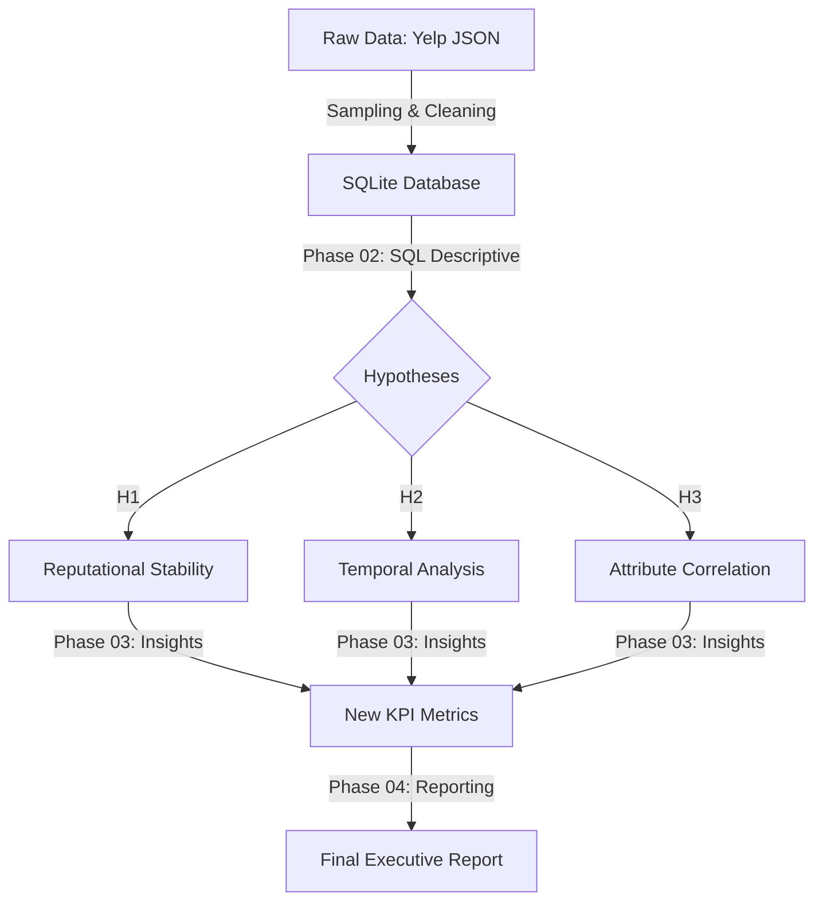
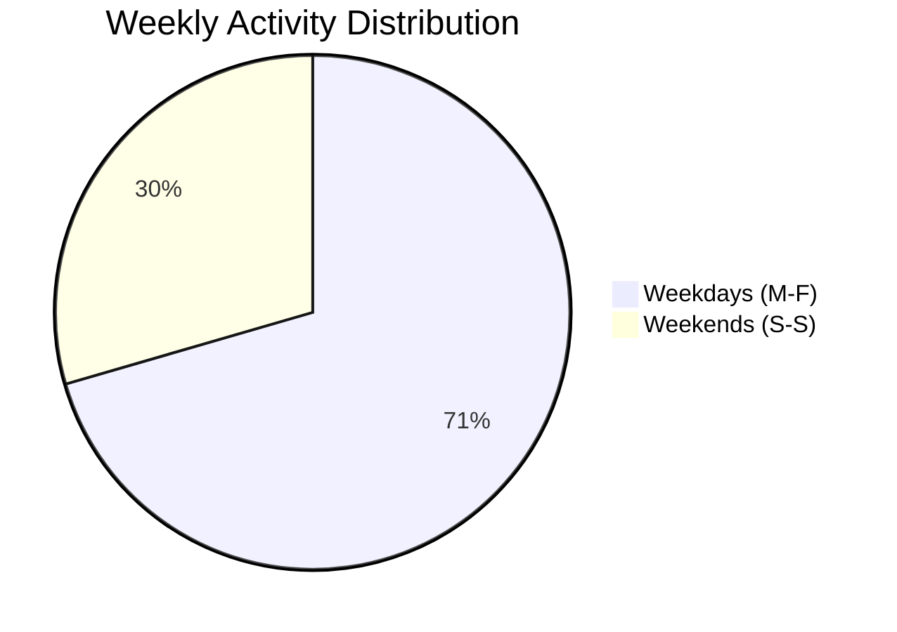

# ☕ CoffeeKing Analytics: Data-Driven Expansion Strategy

[Versión en Español](\docs\ES\04_Presentation_Executive_Report_ES.md)

**Final Data Engineering Report for Executive Management**


---

## 👨‍💼 1. Executive Summary
This project arises from the need to transform **CoffeeKing’s** new branch opening process. By leveraging the Yelp dataset (processed through a modular data architecture), we have transitioned from intuition-based decisions to an **evidence-based investment strategy**.

**Key Conclusion:** The success of our business model does not lie in traditional physical infrastructure (patios/terraces), but in **digital infrastructure and capturing the professional customer** during the workweek.

---

## 📌 2. Project Structure and Methodology
This project follows a modular engineering approach to ensure traceability between business requirements and code:

* **[PHASE 00] Data Schema (ERD):** Relational architecture design and **key definition (PK/FK)** to ensure structural integrity. <details style="display:inline"><summary><b>View Entity-Relationship Diagram (ERD)</b></summary><br></details>
* **[PHASE 01] Project Proposal:** Problem definition, dataset selection, and hypothesis formulation (See `/docs/EN/01_Project_Proposal_CoffeeKing_EN.pdf`).
* **[PHASE 02] Hypothesis Analysis:** Technical validation through advanced SQL and descriptive statistics (See `/scripts/02_Descriptive_Analysis.sql`).
* **[PHASE 03] Advanced Analysis & Metrics:** Correlation identification, KPI implementation (PEI/CP), and text processing preparation (See `/docs/EN/03_Deep_Analysis_Insights_EN.md`).
* **[PHASE 04] Final Executive Report:** Consolidation of strategic findings, final KPI validation (PEI/CP), and management recommendations. Completion of the relational engineering cycle.


## 📊 3. Critical Findings and Hypothesis Validation

### Hypothesis 1: The Maturity Threshold
* **Hypothesis:** Locations need **>100 reviews** to reach a stable rating of **4.0**.
* **Result:** **REFUTED**.
* **Reality:** Volume provides stability, but the market's "glass ceiling" sits at **3.81 stars**.
* **Impact:** We have redefined our **Elite Benchmark to 3.8**, aligning our KPI expectations with competitive reality.

### Hypothesis 2: The "Power User" Profile
We analyzed over **1,000 interactions** to understand the temporal cash flow.


* **Evidence:** Business volume is **138% mayor** higher during the work week.
* **DecisiOn:** New locations must prioritize **Business Districts** over residential areas.

### Hypothesis 3: Wi-Fi vs. Outdoor Seating
Isolation of service impact on customer satisfaction:

| Attribute | Average Rating | Impact vs. Mean |
| :--- | :--- | :--- |
| **Free Wi-Fi** | **3.81** | **+0.16** |
| Outdoor Seating | 3.69 | +0.04 |
| Global Average | 3.65 | 0.00 |


## 📈 4. Implemented Engineering KPIs

### A. Professional Engagement Index (PEI)
$$PEI = \frac{\text{Weekday Reviews}}{\text{Weekend Reviews}}$$
* **Current Value:** **2.39** (Professional segment dominance).

### B. Connectivity Premium (CP)
$$CP = \text{Rating}_{WiFi} - \text{Rating}_{Global}$$
* **Current Value:** **+0.16 Stars** (Reputational return on technological investment).

## 💻 5. Technical Implementation (SQL)

```sql
/* Calculation of Strategic KPIs (CP and PEI)
   This block unifies business logic to avoid column ambiguity.
*/
WITH Metrics_Computation AS (
    SELECT 
        -- Average rating of locations with connectivity (Free Wi-Fi)
        AVG(CASE WHEN b."attributes.WiFi" LIKE '%free%' THEN b.stars END) as wifi_rating,
        -- Global market average rating
        AVG(b.stars) as global_rating,
        -- Activity Ratio: Weekdays vs. Weekends
        COUNT(CASE WHEN strftime('%w', r.date) NOT IN ('0', '6') THEN 1 END) * 1.0 as weekday_count,
        COUNT(CASE WHEN strftime('%w', r.date) IN ('0', '6') THEN 1 END) as weekend_count
    FROM business b
    JOIN review r ON b.business_id = r.business_id
)
SELECT 
    ROUND(wifi_rating - global_rating, 2) AS connectivity_premium,
    ROUND(weekday_count / weekend_count, 2) AS professional_index
FROM Metrics_Computation;
```
## 💡 6. Conclusions and Strategic Recommendations
Based on the data engineering performed, the following immediate actions are recommended:

* **Budget Reallocation (CapEx):** Reduce investment in complex outdoor furniture and guarantee **Wi-Fi 6 infrastructure and charging points** at 100% of the tables. The impact on ratings is **4 times higher**.
* **Expansion Strategy:** Ignore locations in areas with a **projected PEI lower than 1.5**. Our growth directly depends on office-hour traffic flow.
* **Technological Roadmap:** Initiate **Phase 05** using **Apache Spark** for sentiment analysis (NLP) on reviews, identifying key terms that cause friction in the professional customer experience.

---
*Final Data Engineering Document - Project CoffeeKing.*