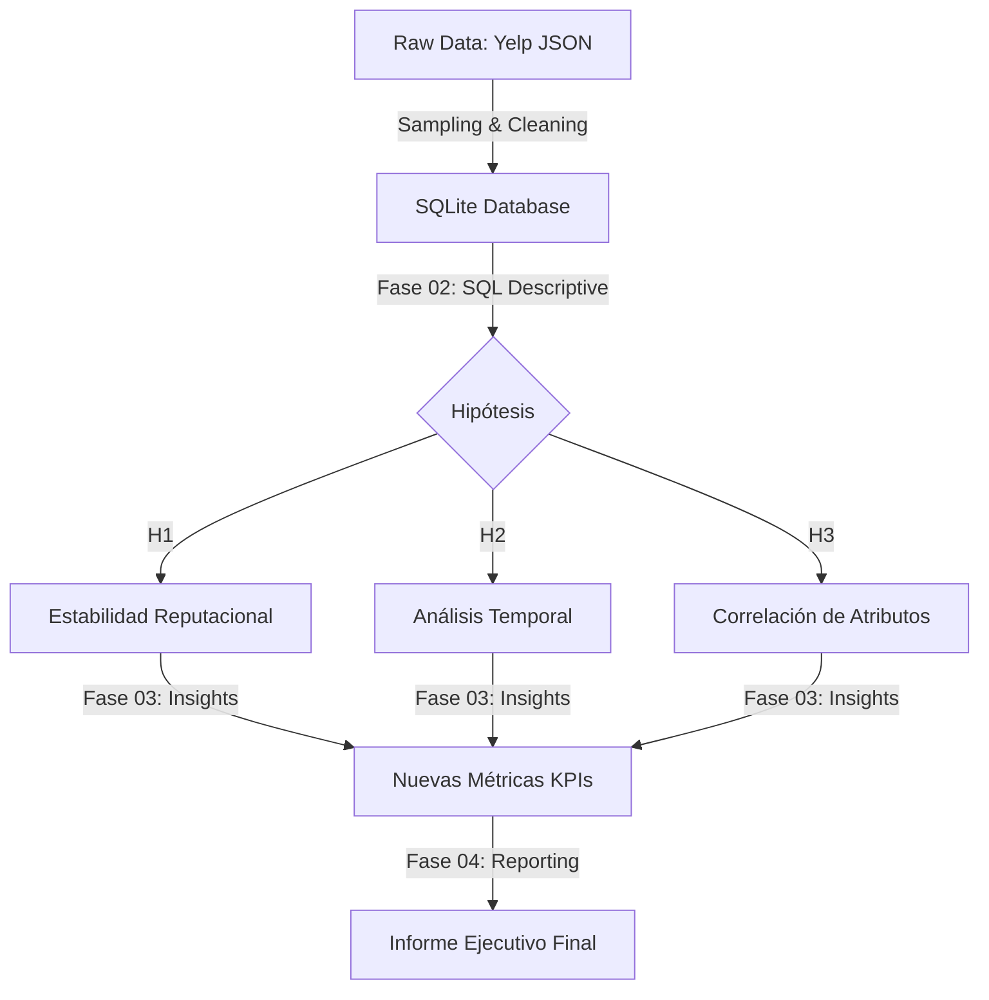
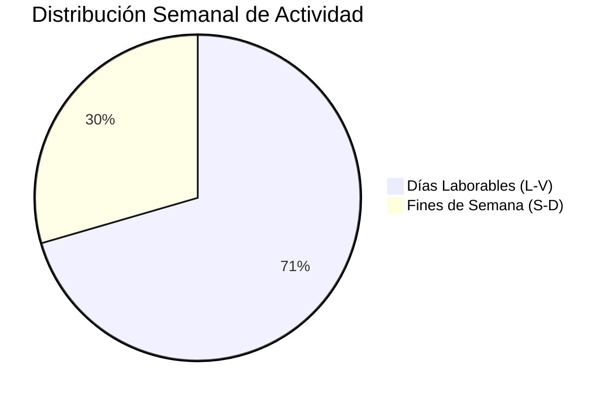

# ☕ CoffeeKing Analytics: Estrategia de Expansión Basada en Datos

[English versiON](/02_SQL_Advanced_Wrangling_and_Testing/02.05_CAPSTONE_CoffeeKing_Yelp/docs/EN/04_Presentation_Executive_Report_EN.md)

**Informe Final de Ingeniería de Datos para la Dirección General**

---


## 👨‍💼 1. Resumen Ejecutivo
Este proyecto surge de la necesidad de transformar el proceso de apertura de nuevas sucursales de **CoffeeKing**. Utilizando el dataset de Yelp (procesado mediante una arquitectura de datos modular), hemos pasado de decisiones basadas en la intuición a una **estrategia de inversión basada en evidencia**.

**Conclusión Principal:** El éxito de nuestro modelo de negocio no reside en la infraestructura física tradicional (terrazas), sino en la **infraestructura digital y la captación del cliente profesional** durante la semana laboral.

---

## 🛠️ 2. Arquitectura de Datos y Metodología
Para garantizar la integridad de los resultados, se implementó un pipeline de datos estructurado en tres fases:



## 📊 3. Hallazgos Críticos y Validación de Hipótesis

### Hipótesis 1: El Umbral de Madurez
* **Hipótesis:** Los locales necesitan **>100 reseñas** para alcanzar un rating estable de **4.0**.
* **Resultado:** **REFUTADA**.
* **Realidad:** El volumen aporta estabilidad, pero el techo de cristal del mercado se sitúa en **3.81 estrellas**.
* **Impacto:** Hemos redefinido nuestro **Benchmark de Élite a 3.8**, lo que ajusta nuestras expectativas de KPIs a la realidad competitiva.

### Hipótesis 2: El Perfil del "Power User"
Analizamos más de **1,000 interacciones** para entender el flujo de caja temporal.



* **Evidencia:** El volumen de negocio es un **138% mayor** durante la semana laboral.
* **Decisión:** Las nuevas ubicaciones deben priorizar **Distritos de Negocios** sobre zonas residenciales.

### Hipótesis 3: Wi-Fi vs. Terraza
Aislamiento del impacto de servicios en la satisfacción del cliente:

| Atributo | Rating Promedio | Impacto vs. Media |
| :--- | :--- | :--- |
| **Wi-Fi Gratuito** | **3.81** | **+0.16** |
| Terraza | 3.69 | +0.04 |
| Promedio Global | 3.65 | 0.00 |

## 📈 4. KPIs de Ingeniería Implementados

### A. Professional Engagement Index (PEI)
$$PEI = \frac{\text{Reseñas Weekdays}}{\text{Reseñas Weekends}}$$
* **Valor Actual:** **2.39** (Dominancia del segmento profesional).

### B. Connectivity Premium (CP)
$$CP = \text{Rating}_{WiFi} - \text{Rating}_{Global}$$
* **Valor Actual:** **+0.16 Estrellas** (Retorno reputacional de la inversión tecnológica).

---

## 💻 5. Implementación Técnica (SQL)

```sql
/* Cálculo de KPIs Estratégicos (CP y PEI)
   Este bloque unifica la lógica de negocio para evitar ambigüedad de columnas.
*/
WITH Metrics_Computation AS (
    SELECT 
        -- Rating promedio de locales con conectividad (Wi-Fi Free)
        AVG(CASE WHEN b."attributes.WiFi" LIKE '%free%' THEN b.stars END) as wifi_rating,
        -- Rating promedio global del mercado
        AVG(b.stars) as global_rating,
        -- Ratio de actividad: Días Laborables vs Fines de Semana
        COUNT(CASE WHEN strftime('%w', r.date) NOT IN ('0', '6') THEN 1 END) * 1.0 as weekday_count,
        COUNT(CASE WHEN strftime('%w', r.date) IN ('0', '6') THEN 1 END) as weekend_count
    FROM business b
    JOIN review r ON b.business_id = r.business_id
)
SELECT 
    ROUND(wifi_rating - global_rating, 2) AS connectivity_premium,
    ROUND(weekday_count / weekend_count, 2) AS professional_index
FROM Metrics_Computation;
```

## 💡 6. Conclusiones y Recomendaciones Estratégicas
Basado en la ingeniería de datos realizada, se recomiendan las siguientes acciones inmediatas:

* **Reasignación de Presupuesto (CapEx):** Reducir la inversión en mobiliario exterior complejo y garantizar una infraestructura de **Wi-Fi 6 y puntos de carga** en el 100% de las mesas. El impacto en el rating es **4 veces superior**.
* **Estrategia de Expansión:** Ignorar locales en zonas con **PEI proyectado menor a 1.5**. Nuestro crecimiento depende directamente del flujo de oficinas.
* **Roadmap Tecnológico:** Iniciar la **Fase 05** utilizando **Apache Spark** para análisis de sentimiento (NLP) en las reseñas, identificando términos clave que causan fricción en la experiencia del cliente profesional.

---
*Documento final de ingeniería de datos - Proyecto CoffeeKing.*