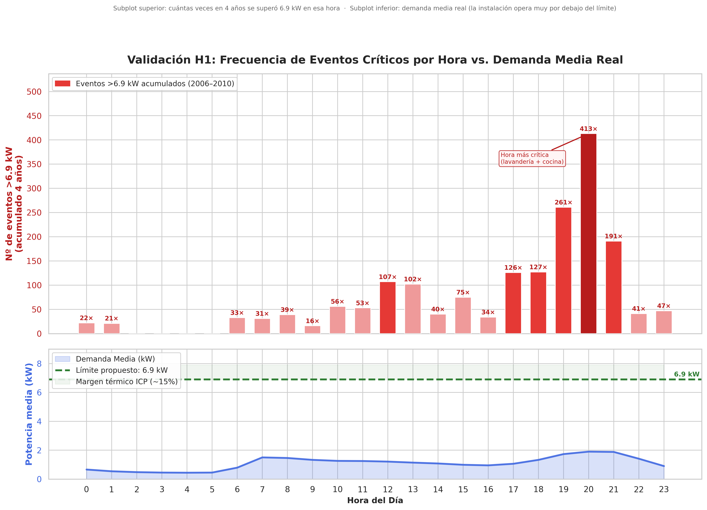
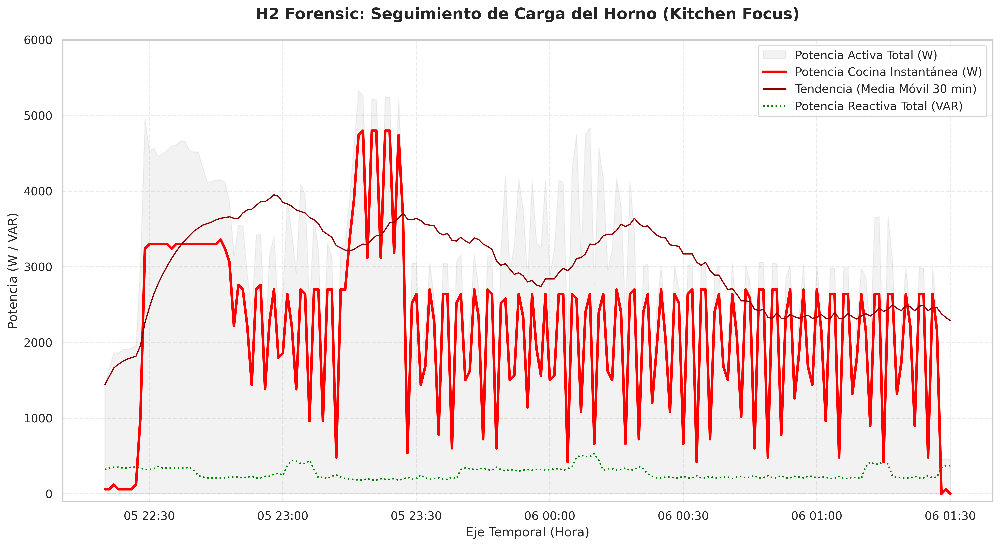
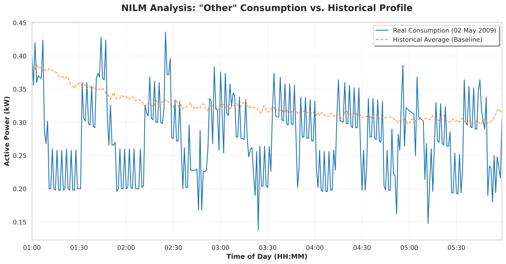
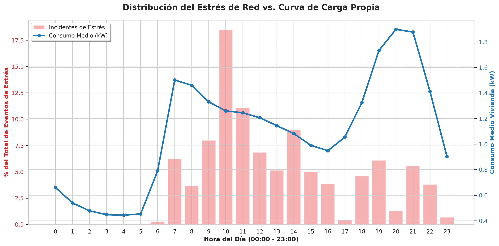
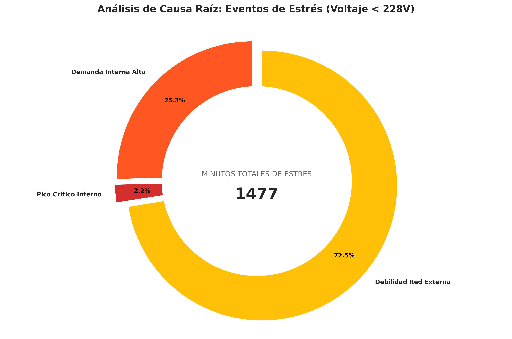

# ⚡ Industrial Energy Analytics: Big Data Spark Capstone

> [!IMPORTANT]
> **Data Engineering Project**. Auditoría forense de alta precisión sobre un dataset de **2.075.259 registros**. Este proyecto utiliza **Apache Spark** para transformar telemetría eléctrica en decisiones financieras estratégicas de ahorro y eficiencia.

---

## 🚀 Acceso Rápido (Project Navigation)

Para una exploración detallada de cada fase, utiliza los siguientes enlaces directos:

* 📂 [**Proposición del Proyecto**](./docs/01_Project_Proposal.md) – *Objetivos y arquitectura del sistema.*
* 📓 [**Jupyter Notebook (PySpark Core)**](./notebooks/01_EDA_Electric_Data.ipynb) – *Pipeline ETL, limpieza y procesamiento distribuido.*
* 📄 [**Reporte Técnico Final**](./docs/03_FINAL_REPORT_Industrial_Energy_Analytics_Spark_Capstone.md) – *Análisis pericial completo y evidencias visuales.*
* 💡 [**Conclusiones Globales**](./docs/02_Global_Conclusions.md) – *Impacto en el negocio y recomendaciones de inversión.*

---

## 1. Resumen Ejecutivo 
El proyecto documenta el desarrollo de un ecosistema de procesamiento masivo diseñado para el análisis del consumo eléctrico industrial/residencial.Bajo la metodología de un **Ingeniero Técnico Industrial**, se trasciende el análisis estadístico simple para centrarse en la integridad del sistema y la validación de 4 hipótesis críticas.

### Métricas de Rendimiento (Benchmarking)
* **Volumen Procesado:** 2.07 millones de registros.
* **Tiempo de Ejecución (ETL):** 6,1 segundos.
* **Hardware:** Intel Core i5-1334U (13th Gen) con 32 GB de RAM.
* **Optimización Spark:** 16 GB asignados al Driver y 8 GB al Executor para procesamiento *In-Memory* total.

---

## 2. Validación de Hipótesis (Resultados)
El núcleo del análisis se divide en cuatro vectores de impacto directo en el ahorro (OpEx/CapEx):

1.  **H1: Optimización de la Curva de Carga:** ✅ **VALIDADA**. Se identificó que la instalación está sobredimensionada. **Recomendación:** Reducción de potencia contratada a **6.9 kW** para ahorro inmediato en el término fijo. 

<b>Ver H1 Evidencia gráfica</b>
 

2.  **H2: Detección de Outliers (3-Sigma):** ✅ **VALIDADA**. Localización de un incidente por factor humano (horno encendido por error) que representó el 72% del gasto energético de ese evento.

<b>Ver H2 Evidencia gráfica</b>
 

3.  **H3: Consumo Residual (Standby):** ✅ **VALIDADA**. Se detectó una ineficiencia crítica del **37.66%**, duplicando el umbral previsto. **Ahorro proyectado:** 1,068 kWh/año mediante sustitución tecnológica.

<b>Ver H3 Evidencia gráfica</b>
 

4.  **H4: Calidad de Suministro:** ⚠️ **PARCIALMENTE VALIDADA**. Se refuta fallo interno pero se confirma riesgo por saturación de la red externa de la distribuidora (Zona de Estrés <228V).

<b>Ver H4 Evidencia gráfica 1</b>
 

<b>Ver H4 Evidencia gráfica 2</b>
 

---

## 💡 Conclusiones Estratégicas
La auditoría revela una excelente salud de infraestructura interna pero una gestión operativa deficiente. 

* **Impacto Económico:** La corrección integral del consumo base y el ajuste de potencia contratada (CapEx 0) maximizan la rentabilidad inmediata de la instalación.
* **Valor de Ingeniería:** Capacidad de realizar Auditoría de Comportamiento (NIALM) para cuantificar ahorros reales mediante automatización.

---

## 🛠️ Stack Tecnológico
* **Motor de Cómputo:** Apache Spark v4.1.1 (PySpark).
* **Almacenamiento:** Formato Apache Parquet con compresión Snappy (Optimización Columnar).
* **Entorno:** VS Code Remote sobre instancia nativa de **Ubuntu (WSL2)**.
* **Paradigma:** Desnormalización (Flat Table) para latencia mínima en computación distribuida.

---

## 🔧 Guía de Ejecución Rápida
Para reproducir este análisis en un entorno local con WSL2:

1. **Instalar dependencias:** `pip install pyspark`.
2. **Navegar al directorio:** `cd ~/Documents/Data-Projects-Repo/...`.
3. **Ejecutar Notebook:** Abrir `notebooks/01_EDA_Electric_Data.ipynb` y seleccionar el Kernel de Python de Ubuntu.

---
**Desarrollado por:** *Ingeniero Técnico Industrial (10 años de experiencia en electricidad industrial) en transición a Data Engineering.*.